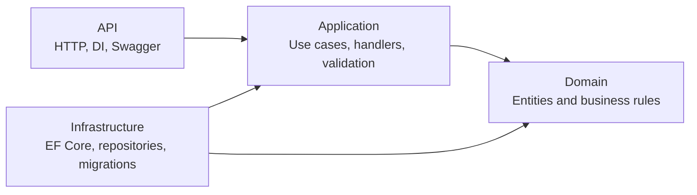
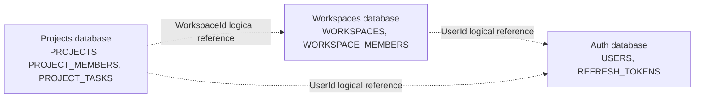

# DevFlow

DevFlow is a learning-focused, microservice-oriented project-management backend built with ASP.NET Core, Entity Framework Core, Oracle, Docker, and GitHub Actions. It currently manages identity, workspaces, projects, memberships, and tasks.

## Architecture

Each service follows the same four-layer structure:



The API layer is the composition root. Application depends on Domain and shared abstractions. Infrastructure implements persistence concerns. Domain has no dependency on the other layers.

## Services

| Service | Responsibility | API | Application | Domain | Infrastructure |
| --- | --- | --- | --- | --- | --- |
| Auth | Users and refresh tokens | [API](DevFlow.Auth.Api/README.md) | [Application](DevFlow.Auth.Application/README.md) | [Domain](DevFlow.Auth.Domain/README.md) | [Infrastructure](DevFlow.Auth.Infrastructure/README.md) |
| Workspaces | Workspace ownership and membership | [API](DevFlow.Workspaces.Api/README.md) | [Application](DevFlow.Workspaces.Application/README.md) | [Domain](DevFlow.Workspaces.Domain/README.md) | [Infrastructure](DevFlow.Workspaces.Infrastructure/README.md) |
| Projects | Projects, project members, and tasks | [API](DevFlow.Projects.Api/README.md) | [Application](DevFlow.Projects.Application/README.md) | [Domain](DevFlow.Projects.Domain/README.md) | [Infrastructure](DevFlow.Projects.Infrastructure/README.md) |

Each service owns its database and migrations. A service must never read or write another service's tables.

## Shared Building Blocks

| Project | Responsibility |
| --- | --- |
| [Auth](DevFlow.BuildingBlocks.Auth/README.md) | Reserved shared authentication primitives. |
| [Messaging](DevFlow.BuildingBlocks.Messaging/README.md) | Custom mediator contracts, mediator, and validation pipeline. |
| [Results](DevFlow.BuildingBlocks.Results/README.md) | `Result<T>`, errors, and validation failures. |
| [Validation](DevFlow.BuildingBlocks.Validation/README.md) | Custom validator abstractions. |
| [Web](DevFlow.BuildingBlocks.Web/README.md) | Shared ASP.NET Core mapping from `Result<T>` to HTTP responses. |

## Local Containers

Docker Compose is split by responsibility:

| File | Responsibility |
| --- | --- |
| [compose.infrastructure.yaml](compose.infrastructure.yaml) | Oracle databases, persistent volumes, and database health checks. |
| [compose.services.yaml](compose.services.yaml) | Backend service images and internal service-to-database connections. |
| [compose.dev.yaml](compose.dev.yaml) | Development environment settings and host port mappings. |

Create a local `.env` file from [`.env.example`](.env.example) and provide values for the Oracle administrator and application-user passwords. Never commit `.env`.

Validate the combined development configuration:

```bash
docker compose \
  --env-file .env \
  -f compose.infrastructure.yaml \
  -f compose.services.yaml \
  -f compose.dev.yaml \
  config
```

Start the development stack:

```bash
docker compose \
  --env-file .env \
  -f compose.infrastructure.yaml \
  -f compose.services.yaml \
  -f compose.dev.yaml \
  up --build
```

Stop containers while retaining them and all database data:

```bash
docker compose \
  --env-file .env \
  -f compose.infrastructure.yaml \
  -f compose.services.yaml \
  -f compose.dev.yaml \
  stop
```

Use `down` to remove containers and networks while retaining named database volumes. Do not use `down -v` unless you explicitly intend to delete local Oracle data.

| Service | Dockerfile | Development host endpoint |
| --- | --- | --- |
| Auth | [Dockerfile](DevFlow.Auth.Api/Dockerfile) | `http://localhost:8081` |
| Workspaces | [Dockerfile](DevFlow.Workspaces.Api/Dockerfile) | `http://localhost:8082` |
| Projects | [Dockerfile](DevFlow.Projects.Api/Dockerfile) | Development port mapping still to be added. |

## Database Ownership



Cross-service IDs are logical references, not Oracle foreign keys. Physical foreign keys exist only inside the database owned by one service. See the full [database schema](docs/database-schema.md), including the three ER diagrams.

## Current Endpoints

| Service | Endpoint | Purpose |
| --- | --- | --- |
| Auth | `POST /api/auth/register` | Register a user. |
| Projects | `POST /api/projects` | Create a project. |
| Projects | `POST /api/projects/{projectId}/tasks` | Create a task in a project. |
| All APIs | `GET /health` | Liveness endpoint. |

Swagger is available only in the Development environment. For the currently exposed APIs, visit `/swagger` on the service host port.

## Migrations

Apply migrations per service from the repository root:

```bash
dotnet ef database update --project DevFlow.Auth.Infrastructure/DevFlow.Auth.Infrastructure.csproj --startup-project DevFlow.Auth.Api/DevFlow.Auth.Api.csproj --context AuthDbContext
dotnet ef database update --project DevFlow.Workspaces.Infrastructure/DevFlow.Workspaces.Infrastructure.csproj --startup-project DevFlow.Workspaces.Api/DevFlow.Workspaces.Api.csproj --context WorkspacesDbContext
dotnet ef database update --project DevFlow.Projects.Infrastructure/DevFlow.Projects.Infrastructure.csproj --startup-project DevFlow.Projects.Api/DevFlow.Projects.Api.csproj --context ProjectsDbContext
```

## Quality and CI

The repository pins the .NET SDK in [global.json](global.json) and enforces repository-wide build standards through [.editorconfig](.editorconfig) and [Directory.Build.props](Directory.Build.props).

Run the local quality checks before opening a pull request:

```bash
dotnet format whitespace DevFlow.slnx --verify-no-changes --no-restore
dotnet format style DevFlow.slnx --verify-no-changes --no-restore --severity info
dotnet build DevFlow.slnx --configuration Release
dotnet test DevFlow.slnx --configuration Release --collect:"XPlat Code Coverage" --results-directory artifacts/test-results
```

GitHub Actions runs on every branch push and on pull requests to `main`. It verifies formatting, performs a strict Release build, runs unit tests with coverage, audits NuGet dependencies, scans Git history for secrets, and builds/scans the Auth API image. The `main` branch ruleset requires these checks before merging.

## Development Conventions

- Commands implement `IRequest<T>` and are handled through the custom mediator.
- Command handlers return `Result<T>` rather than throwing expected business errors.
- Validators run in the mediator pipeline before handlers.
- API controllers use the shared Web building block to map results to HTTP responses.
- Feature folders match feature namespaces, such as `Auth.Application.Register` and `Projects.Application.ProjectTasks`.
- External ownership is represented by IDs, not cross-service database foreign keys.

## Further Reading

- [Database schema](docs/database-schema.md)
- [Project roadmap](Goal.md)
