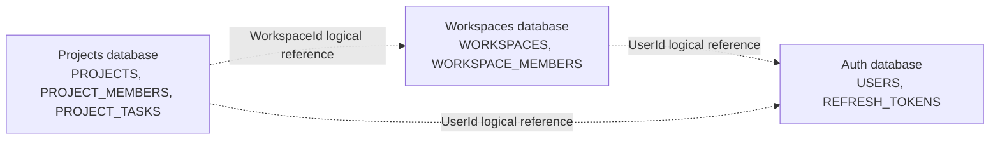

# DevFlow

DevFlow is a learning-focused project-management backend built with ASP.NET Core, Entity Framework Core, Oracle, Docker, and microservice boundaries. The current services manage identity, workspaces, projects, memberships, and tasks.

## Architecture

Each service follows the same four-layer structure:


The API layer is the composition root. Application depends on Domain and shared abstractions. Infrastructure implements persistence concerns. Domain has no dependency on the other layers.

## Services

| Service | Responsibility | API | Application | Domain | Infrastructure |
| --- | --- | --- | --- | --- | --- |
| Auth | Users and refresh tokens | [API](DevFlow.Auth.Api/README.md) | [Application](DevFlow.Auth.Application/README.md) | [Domain](DevFlow.Auth.Domain/README.md) | [Infrastructure](DevFlow.Auth.Infrastructure/README.md) |
| Workspaces | Workspace ownership and membership | [API](DevFlow.Workspaces.Api/README.md) | [Application](DevFlow.Workspaces.Application/README.md) | [Domain](DevFlow.Workspaces.Domain/README.md) | [Infrastructure](DevFlow.Workspaces.Infrastructure/README.md) |
| Projects | Projects, project members, and tasks | [API](DevFlow.Projects.Api/README.md) | [Application](DevFlow.Projects.Application/README.md) | [Domain](DevFlow.Projects.Domain/README.md) | [Infrastructure](DevFlow.Projects.Infrastructure/README.md) |

## Shared Building Blocks

| Project | Responsibility |
| --- | --- |
| [Auth](DevFlow.BuildingBlocks.Auth/README.md) | Reserved shared authentication primitives. |
| [Messaging](DevFlow.BuildingBlocks.Messaging/README.md) | Custom mediator contracts, mediator, and validation pipeline. |
| [Results](DevFlow.BuildingBlocks.Results/README.md) | `Result<T>`, errors, and validation failures. |
| [Validation](DevFlow.BuildingBlocks.Validation/README.md) | Custom validator abstractions. |
| [Web](DevFlow.BuildingBlocks.Web/README.md) | Shared ASP.NET Core mapping from `Result<T>` to HTTP responses. |

## Local Infrastructure

Start the three local Oracle databases:

```bash
docker compose up -d
```

| Service | Database container | Host port | Oracle user |
| --- | --- | ---: | --- |
| Auth | `devflow-auth-db` | `1522` | `authuser` |
| Workspaces | `devflow-workspaces-db` | `1523` | `workspacesuser` |
| Projects | `devflow-projects-db` | `1524` | `projectsuser` |

Each service owns its own database container and migrations. A service must never read or write another service's tables.

## Database Ownership



Cross-service IDs are logical references, not Oracle foreign keys. Physical foreign keys exist only inside the database owned by one service. See the full [database schema](docs/database-schema.md), including the three ER diagrams.

## Current Endpoints

| Service | Endpoint | Purpose |
| --- | --- | --- |
| Auth | `POST /api/auth/register` | Register a user. |
| Projects | `POST /api/projects` | Create a project. |
| Projects | `POST /api/projects/{projectId}/tasks` | Create a task in a project. |
| All APIs | `GET /health` | Liveness endpoint. |

Swagger is enabled in the Development environment.

## Migrations

Apply migrations per service. Run these from the repository root:

```bash
dotnet ef database update --project DevFlow.Auth.Infrastructure/DevFlow.Auth.Infrastructure.csproj --startup-project DevFlow.Auth.Api/DevFlow.Auth.Api.csproj --context AuthDbContext
dotnet ef database update --project DevFlow.Workspaces.Infrastructure/DevFlow.Workspaces.Infrastructure.csproj --startup-project DevFlow.Workspaces.Api/DevFlow.Workspaces.Api.csproj --context WorkspacesDbContext
dotnet ef database update --project DevFlow.Projects.Infrastructure/DevFlow.Projects.Infrastructure.csproj --startup-project DevFlow.Projects.Api/DevFlow.Projects.Api.csproj --context ProjectsDbContext
```

## Development Conventions

- Commands implement `IRequest<T>` and are handled through the custom mediator.
- Command handlers return `Result<T>` rather than throwing expected business errors.
- Validators run in the mediator pipeline before handlers.
- API controllers use the shared Web building block to map results to HTTP responses.
- External ownership is represented by IDs, not cross-service database foreign keys.

## Further Reading

- [Database schema](docs/database-schema.md)
- [Project roadmap](Goal.md)
- [Docker Compose configuration](docker-compose.yaml)
