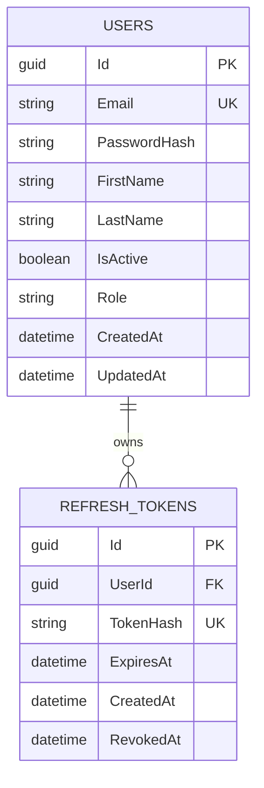
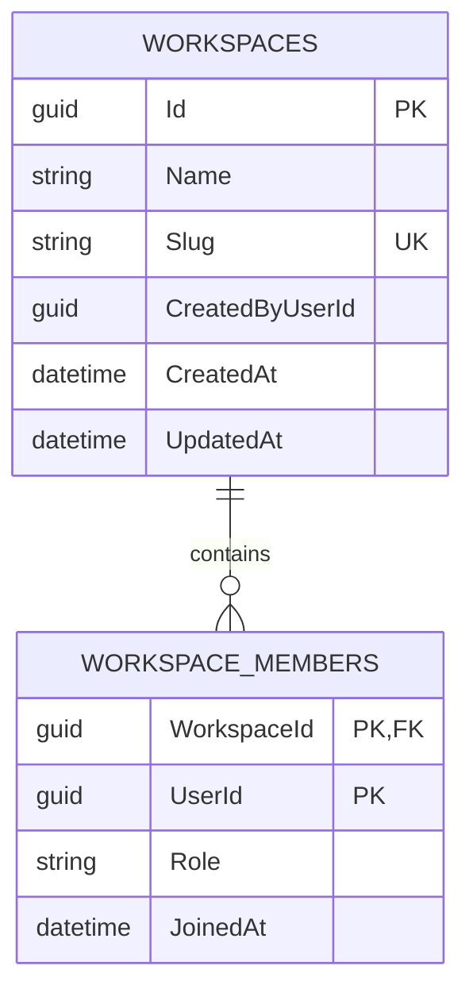
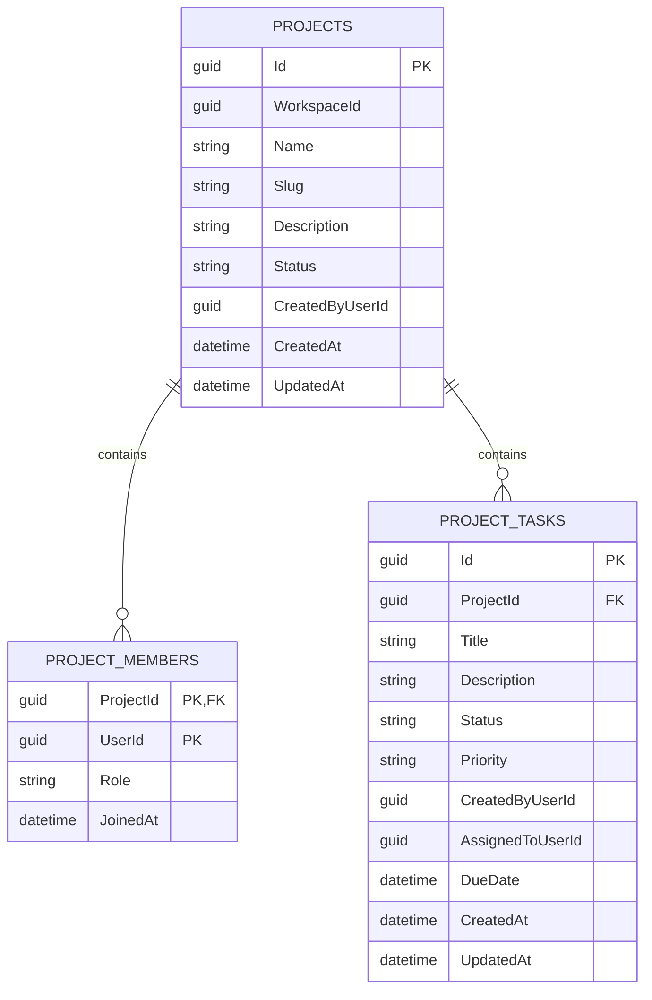
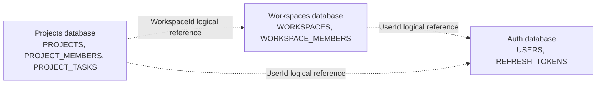

# Database Schema

Each microservice owns a separate Oracle database container. Foreign keys exist only within the owning service database. IDs that point to data owned by another service are logical references, not database constraints.

## Auth Database

## Workspaces Database

`CreatedByUserId` and `WorkspaceMembers.UserId` are logical references to `Auth.USERS.Id`.

## Projects Database

`WorkspaceId` is a logical reference to `Workspaces.WORKSPACES.Id`. `CreatedByUserId`, `ProjectMembers.UserId`, `ProjectTasks.CreatedByUserId`, and `ProjectTasks.AssignedToUserId` are logical references to `Auth.USERS.Id`. `WorkspaceId` and `Slug` have a composite unique index, so the same slug may exist in different workspaces.

## Service Ownership

